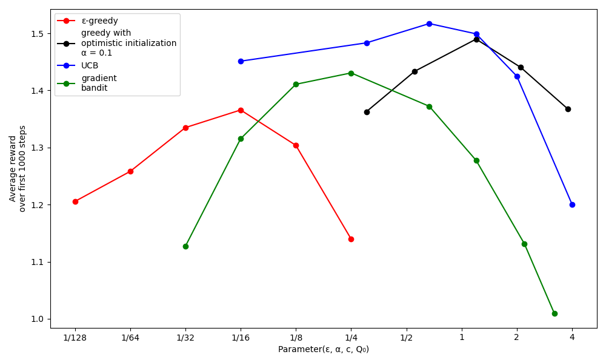

# Multi-Armed Bandit Algorithms Simulation  

This project implements and compares various algorithms inspired by Chapter 2 of the book *Reinforcement Learning an Introduction*. The main focus is on balancing exploration and exploitation while evaluating the performance of these algorithms.  

---

## Overview  

The project simulates four main bandit algorithms:  
- **ε-greedy**: Balances exploration and exploitation using a probability, ε, to randomly explore actions.  
- **Optimistic Greedy**: Uses optimistic initial estimates to encourage exploration early in learning.  
- **UCB (Upper Confidence Bound)**: Incorporates the uncertainty of action-value estimates to drive exploration.  
- **Gradient Bandit**: Utilizes gradient-based optimization for prioritizing actions.  

Each algorithm's performance is evaluated based on average rewards over 1000 steps, and results are plotted for various parameter settings.  

---

## Analysis of the Results  

### **1. Description of the Plot**  
- The x-axis represents the values of key parameters for each algorithm (e.g., ε for ε-greedy, α for Gradient Bandit).  
- The y-axis shows the average reward over the first 1000 steps.  
- Each data point represents the average performance of the corresponding algorithm at a specific parameter setting.  

### **2. Sensitivity to Parameters**  
- It's important to consider both the best performance of an algorithm and how sensitive it is to changes in its parameter values.  
- Fortunately, all the algorithms demonstrated relative insensitivity to parameter changes, performing well across a range of values spanning about an order of magnitude.  

### **3. Algorithm Comparison**  
- Among the algorithms tested, **UCB (Upper Confidence Bound)** exhibited the best overall performance in this problem.  
- The simplicity and effectiveness of these algorithms make them suitable for various real-world problems despite their inherent limitations for example : Resource Allocation, Manufacturing Process Optimization, Personalized Medicine, Product Recommendations and Online Advertising. 

### **4. Limitations and Future Directions**  
- While the presented algorithms are effective for balancing exploration and exploitation, they are far from a complete solution to the problem, These methods, despite their simplicity and effectiveness in many cases, may not always provide the optimal solution in more complex or dynamic environments. One limitation is their reliance on the assumption of stationary environments, which may not hold true in real-world applications where conditions can change over time.

---

## How to Run  

### **Prerequisites**  
- Python 3.8 or later  
- Required libraries: `numpy`, `matplotlib`, `tqdm`, `multiprocessing`  

## **References ----------** 
* Sutton, R. S., & Barto, A. G. _Reinforcement Learning: An Introduction_ (2nd ed.). Chapter 2.
* Further reading: Bayesian methods for balancing exploration and exploitation, including Gittins indices and Thompson sampling.”

