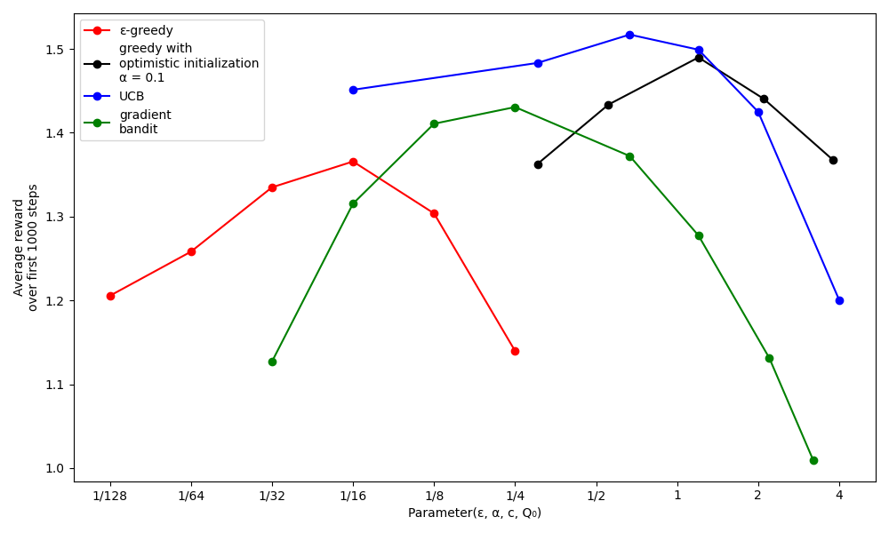

# Multi-Armed Bandit Algorithms Simulation  

This project implements and compares various algorithms inspired by Chapter 2 of the book *Reinforcement Learning an Introduction*. The main focus is on balancing exploration and exploitation while evaluating the performance of these algorithms.  

---

## Overview  

The project simulates four main bandit algorithms:  
- **ε-greedy**: Balances exploration and exploitation using a probability, ε, to randomly explore actions.  
- **Optimistic Greedy**: Uses optimistic initial estimates to encourage exploration early in learning.  
- **UCB (Upper Confidence Bound)**: Incorporates the uncertainty of action-value estimates to drive exploration.  
- **Gradient Bandit**: Utilizes gradient-based optimization for prioritizing actions.  

Each algorithm's performance is evaluated based on average rewards over 1000 steps, and results are plotted for various parameter settings.  

---

## Analysis of the Results  

#### Epsilon-Greedy Algorithm (ε-greedy)

The **ε-greedy algorithm** uses a simple strategy to balance exploration and exploitation. At each step, it either explores a random arm with probability ε, or exploits the arm with the highest estimated value. In this experiment, we tested various values of ε, ranging from 1/128 to 1/4. The results show that the ε-greedy algorithm performs reasonably well, with small variations depending on the choice of ε. Larger ε values lead to more exploration, but this can reduce the performance in certain cases.

#### Optimistic Greedy Algorithm

The **Optimistic Greedy algorithm** employs an optimistic initialization of the action value estimates, assuming all arms are initially superior. The algorithm then uses a greedy approach to select the best arm based on updated estimates. We tested different optimistic initial values (Q₀), which influenced the algorithm's performance. Higher initial values led to more exploration initially, but the algorithm performed consistently well across a range of values.

#### Upper Confidence Bound (UCB)

The **UCB algorithm** aims to balance exploration and exploitation using a confidence bound for each arm. It selects the arm with the highest upper confidence bound, which is a function of the estimated reward and the uncertainty (variance). The UCB algorithm showed the best performance in this experiment, performing well across a wide range of parameter values. This indicates that UCB is less sensitive to the choice of its exploration parameter `c` compared to other algorithms.

#### Gradient Bandit Algorithm

The **Gradient Bandit algorithm** adjusts action preferences based on a gradient of the reward, updating preferences using a learning rate (α). This method is different from others as it does not rely on explicit reward estimation. We tested various values for α, and the algorithm showed robust performance across a wide range of α values. It adapted to the environment effectively, balancing exploration and exploitation in a unique way.

### 1. Description of the Plot
The x-axis represents the values of key parameters for each algorithm (e.g., ε for ε-greedy, α for Gradient Bandit).  
The y-axis shows the average reward over the first 1000 steps.  
Each data point represents the average performance of the corresponding algorithm at a specific parameter setting.

### **2. Sensitivity to Parameters**  
- It's important to consider both the best performance of an algorithm and how sensitive it is to changes in its parameter values.  
- Fortunately, all the algorithms demonstrated relative insensitivity to parameter changes, performing well across a range of values spanning about an order of magnitude.  

### **3. Algorithm Comparison**  
- Among the algorithms tested, **UCB (Upper Confidence Bound)** exhibited the best overall performance in this problem.  
- The simplicity and effectiveness of these algorithms make them suitable for various real-world problems despite their inherent limitations for example:
- **Resource Allocation**
- **Manufacturing Process Optimization**
- **Personalized Medicine**
- **Product Recommendations**
- **Online Advertising**

### **4. Limitations and Future Directions**  
- While the presented algorithms are effective for balancing exploration and exploitation, they are far from a complete solution to the problem.
- These methods, despite their simplicity and effectiveness in many cases, may not always provide the optimal solution in more complex or dynamic environments. One limitation is their reliance on the assumption of stationary environments, which may not hold true in real-world applications where conditions can change over time.

---

## How to Run  

### **Prerequisites**  
- Python 3.8 or later  
- Required libraries: `numpy`, `matplotlib`, `tqdm`, `multiprocessing`  

## **📚 Resources**
* Sutton, R. S., & Barto, A. G. _Reinforcement Learning: An Introduction_ (2nd ed.). Chapter 2.

## **📧 Contact**
* Author : Ali Asanjarany
* Email : ali.asanjarany@gamil.com
  
## **🌟 If You Found This Useful :**
* ⭐ Star this repository!
* 📨 Share it with your friends!
* 💬 Submit your feedback in the Issues section!

## Project Timeline

| Stage            | Description                       | Start Date  | End Date    | Duration   |
|-------------------|-----------------------------------|-------------|-------------|------------|
| Research          | Studying reinforcement learning  | 2024-11-27  | 2024-11-30  | 4 days     |
| Development       | Coding and implementing project  | 2024-12-1  | 2024-12-4  | 4 days     |
| Testing and Debug | Final debugging and testing      | 2024-12-5  | 2024-12-7  | 3 days     |

**Total Duration :** 11 days
